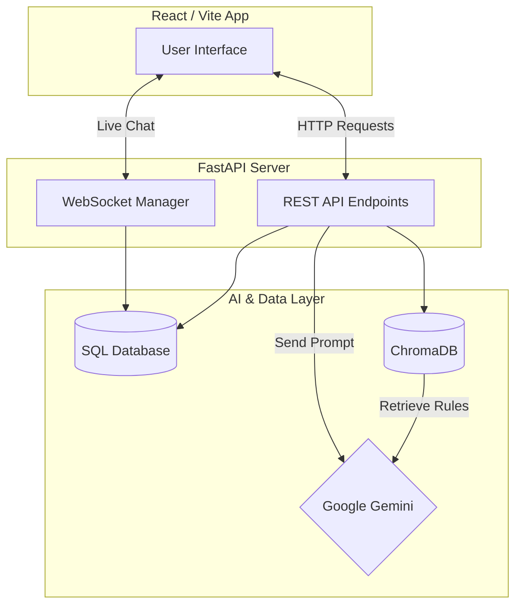
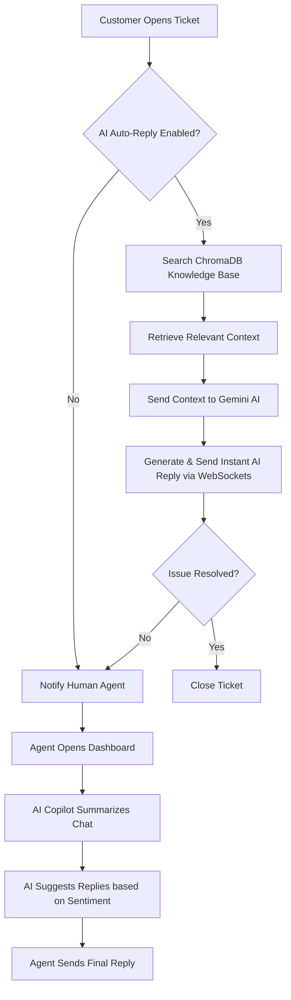

# AI Customer Support Platform - Project Documentation

## 1. Abstract
The AI Customer Support Platform is a modern, real-time ticketing system designed to bridge the gap between frustrated customers and overwhelmed support agents. By integrating advanced Large Language Models (LLMs) and Retrieval-Augmented Generation (RAG) techniques, the platform automates initial responses to routine queries while intelligently escalating complex issues to human agents. Support agents are empowered with an "AI Copilot" that analyzes sentiment, summarizes long chat histories, and drafts context-aware replies. The result is a highly responsive, scalable, and intelligent support ecosystem that drastically reduces resolution times and improves customer satisfaction.

---

## 2. Problem Statement
Traditional customer support systems suffer from two major bottlenecks:
1. **Customer Frustration**: Users face long wait times in queues for answers to basic, repetitive questions.
2. **Agent Burnout**: Human agents are overwhelmed by high volumes of mundane tickets, leaving them with less time to solve complex, nuanced problems that actually require human empathy and critical thinking.

**The Goal**: To build a real-time ticketing platform where AI instantly resolves common queries and acts as an intelligent assistant for human agents, enabling them to work 10x faster.

---

## 3. Technology Stack
Our platform utilizes a cutting-edge, highly responsive technology stack:

*   **Frontend**: React 19, Vite, Tailwind CSS v4, Framer Motion (for animations), React Router, and Axios.
*   **Backend**: FastAPI (Python), Uvicorn, SQLAlchemy (SQLite/PostgreSQL).
*   **Real-time Communication**: WebSockets for instant, bi-directional messaging.
*   **AI Engine**: Google Gemini API (Deep Learning/Transformers) for Natural Language Processing (NLP), Summarization, and Sentiment Analysis.
*   **RAG & Memory**: ChromaDB (Vector Database) and Sentence Transformers for semantic search over company knowledge bases.

---

## 4. System Architecture

The following diagram illustrates how the different components of the system interact with each other, highlighting the integration of WebSockets for real-time chat and the AI pipeline.

---

## 5. System Flowchart

Here is the operational flow when a customer creates a ticket and sends a message.

---

## 6. Database Schema (ER Diagram)

The relational database manages users, tickets, messages, and AI analysis data.

**1. USERS Table**
| Column | Type | Description |
| :--- | :--- | :--- |
| **id** | Integer | Primary Key |
| **name** | String | Full name |
| **email** | String | User's email |
| **password_hash** | String | Encrypted password |
| **role** | String | Customer, Agent, or Admin |
| **created_at** | DateTime | Account creation date |

**2. TICKETS Table**
| Column | Type | Description |
| :--- | :--- | :--- |
| **id** | Integer | Primary Key |
| **user_id** | Integer | Foreign Key (Users) |
| **assigned_to** | Integer | Foreign Key (Users) |
| **title** | String | Ticket subject |
| **description** | Text | Issue details |
| **status** | String | Open, Pending, Closed |
| **priority** | String | Low, Medium, High |

**3. MESSAGES Table**
| Column | Type | Description |
| :--- | :--- | :--- |
| **id** | Integer | Primary Key |
| **ticket_id** | Integer | Foreign Key (Tickets) |
| **sender_id** | Integer | Foreign Key (Users) |
| **message** | Text | Chat content |
| **timestamp** | DateTime | Time sent |

**4. AI_ANALYSIS Table**
| Column | Type | Description |
| :--- | :--- | :--- |
| **id** | Integer | Primary Key |
| **ticket_id** | Integer | Foreign Key (Tickets) |
| **sentiment** | String | Happy, Neutral, Frustrated |
| **category** | String | Issue category |
| **summary** | Text | 3-bullet point summary |

**5. KNOWLEDGE_BASE Table**
| Column | Type | Description |
| :--- | :--- | :--- |
| **id** | Integer | Primary Key |
| **title** | String | Document title |
| **content** | Text | Company rules/policies |
| **source** | String | Origin of document |

---

## 7. User Interfaces

*(Note: Please insert your actual screenshots below each heading)*

### 7.1 Sign In Page
**[Insert Screenshot of Sign In Page Here]**
> **Explanation**: A secure, modern login portal that routes users to their specific dashboards based on their Role-Based Access Control (RBAC) profile (Customer, Agent, or Admin).

### 7.2 Customer Ticket Box
**[Insert Screenshot of Customer Ticket Box Here]**
> **Explanation**: A live chat interface using WebSockets. Customers receive instantaneous replies generated by the AI without needing to refresh the page.

### 7.3 Agent Dashboard
**[Insert Screenshot of Agent Dashboard Here]**
> **Explanation**: The control center for support staff. It features the "AI Copilot" sidebar which automatically summarizes long chat histories and detects customer sentiment.

### 7.4 Admin Dashboard
**[Insert Screenshot of Admin Dashboard Here]**
> **Explanation**: A high-level overview of system metrics, ticket volumes, and agent performance, providing insights into overall customer satisfaction.

### 7.5 Knowledge Base
**[Insert Screenshot of Knowledge Base Here]**
> **Explanation**: The interface where admins upload company rulebooks. This data is converted into vectors and stored in ChromaDB to power the RAG pipeline.

---

## 8. API Endpoints Overview

The backend exposes a comprehensive RESTful API alongside WebSocket connections.

*(Note: Please insert a screenshot of your Swagger UI / `/docs` page here)*
**[Insert Screenshot of API Endpoints Here]**

### Key Endpoints:
*   **Authentication**: 
    *   `POST /login` - Generate JWT tokens.
    *   `POST /register` - Register a new user.
*   **Tickets & Chat**:
    *   `GET /tickets` & `POST /tickets` - Manage ticket lifecycle.
    *   `GET /messages/{ticket_id}` - Retrieve chat history.
    *   `WS /ws/chat/{ticket_id}` - WebSocket endpoint for real-time messaging.
*   **AI Integrations**:
    *   `POST /ai/summarize/{ticket_id}` - Generate a 3-bullet summary of a chat.
    *   `POST /ai/analyze-sentiment/{ticket_id}` - Detect customer emotions.
    *   `POST /ai/reply-suggestions/{ticket_id}` - Generate context-aware reply drafts.
*   **Knowledge Base (RAG)**:
    *   `POST /kb` & `GET /kb` - Manage company documents for semantic search.
